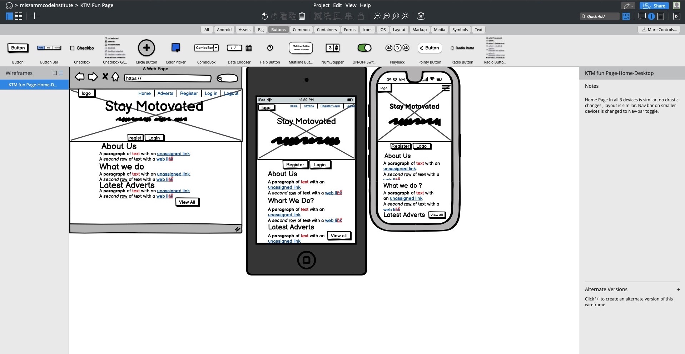
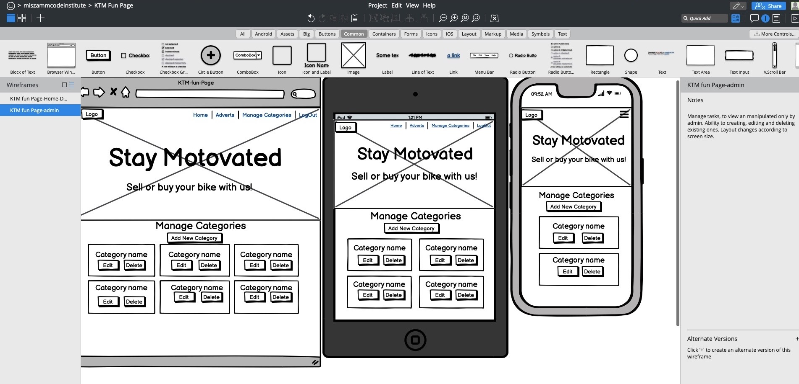
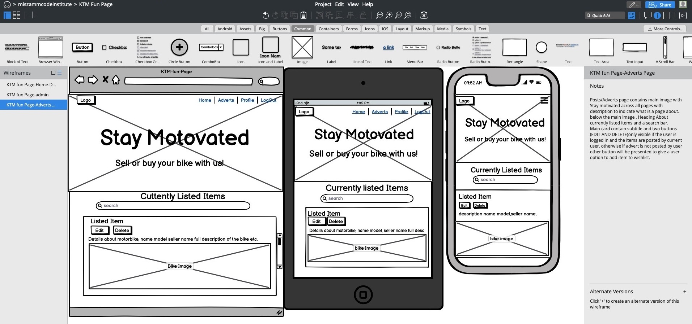

<h1>KTM Fun Page</h1>

Main Goal For This Project

The main goal for this project is app is to connect people who are kTM Brand enthusiasts, 
to help them to buy or sell their motorbikes. If you ever tried to advertise your car or bike 
true different platforms? It's not as straight forward as it might sound. If you go to Auto Trader, Carzone or Done deal websites
where you have all brands mixed up, the chances that your item will be seen often enough to convinced someone to buy it are rather low.
This App is brand specific and brings all people who are KTM BIkes fans. The foundation for this project is Code Institut mini project,
presented and well explained by Tutor Tim Nelson, so massive thank you to you Tim.
Massive thank you for visiting this ptoject!
If you have any feedback or questions, please find my contact deatails on GitHub and feel free to share your thoughts with me.

<h1>Table of content:</h1>

1. UX
- User Goals
- User Stories
- App Owner Goals
- Design (color scheeme, fonts, site structure)
2. Deployment 
- Local Deployment
- Deployment to Heroku
3. Wireframes and Database Structure
4. Features
- Existing Features
- Features For Further Implementation
5. Technologies
- Languages
- Frameworks and Libriares
6. Testing
7. Thanks To:

# 1. UX
<h2>User Goals:</h2>

- Home page gives a clear indication about it's purpose with most relevant data easly accesible

- The website has to be easy to navigate and self epxlenatory

- Has to work on all types of devices like tablet, mobile phone, desktop

- Has to give ability to update delete or obtain information

- has to give an option to easy control of logs 

- Sell or buy an item as easly and convinient as possible

<h2>User Stories</h2>

- As a user, I want website to be easy to navigate.

- As a user, I want website to be intuitive.

- As a user, I would like to  have an option to register 
  and have information related to my account accesible after log in.

- As a user, I would like to have an ability to add or remove items.

- As a user, I would like to be able to edit information relevant to my account.

- As a user, I would like to edit informations about items Advertised by me. 

- As a user, I would like to add to wishlist adverts I am interested in.

- As a user, I would like to have an option to delete items if they are no longer relevant.

- As a user, I want process to add, edit update and delete to be as easy as possible.

<h2>App Owner Goals</h2>

- To have an appealing website to connect pople with pasion to KTM Bikes, where users can buy and sell their bikes.

- Provide great website functionality for the users, by giving them easy acces to information they are looking for.

- To create website where users have their own space and they feel like they want to come back to.

<h2>Design (color scheeme, fonts, site structure)</h2>

Design Choices

For this project i used Bootstrap framework cold Clean Blog because it fits perfectly into a nature of the website and it will be 
very easy to update and expand in the future. On the other haand it's minimalistic design wil accomodate users in any age, and it will not be 
intimidating to people with lower computer skills. The target was to create self explanatory home page with nicley toned colors rather than 
wide selection of bright , overwhelming colors which might drow attention away from important things.
Colors used for this project are strictly assosiated with KTM brand.

Color Sccheeme

As mentioned above colors used for the site are colors asocciated with KTM brand, and consist orange , black, white and grey.
 
 - [Coolors](https://coolors.co/f2771a-1c1919-7e7e82-ffffff)

 - #Hex: #1C1919,	
Name: Eerie Black
RGB: (28, 25, 25)
CMYK: 0, 0.107, 0.107, 0.890
 - Hex: #F2771A,	
Name: Pumpkin
RGB: (242, 119, 26)
CMYK: 0, 0.508, 0.892, 0.050

 - HEX: #FFFFFF,
 RGB:(255,255,255)

 - HEX: #7E7E82,
 RGB: (	126, 126, 130)

 I have used a contrast checker in order to make sure that the contrast is sufficient. 
 This way my content will be easily readable.

Fonts

Appropreate fonds where included in bootstrap clean Blog framework, and font included are as follow:
Open Sans','Helvetica Neue',Helvetica,Arial,sans-serif.

Structure

I have choosen Bootstrap framework to create overall structure of this app. Bootstrap provides vast range of 
elements of CSS and Javascript which help to maintaine correct structure and functionality of the page. 

# 2. Deployment 

Website was created using GitHub, from there I used[Gitpod]()to write the code, followed by commits to git, and further pushed to my 
GitHub repository with use of "git push" command. I've deployed this project to Heroku and used "git push heroku master" to make sure  
all the changes to GitHub were also made to Heroku.

This project can be ran locally by following the following steps: ( I used Gitpod for development, so the following steps will be specific to Gitpod. 
The changes will have to be applied depending on your IDE. You can find more information about installing packages using pip and virtual environments [here](https://packaging.python.org/guides/installing-using-pip-and-virtual-environments/)

1. From  the aplication repository, click green code button to download zip file of repository.

2. Acces the folder in terminal window to instsll application [required modules](requirements.txt) with "pip3 install -r requirements.txt" .

3. Sign up/sign in to [Mongo.DB](https://www.mongodb.com/) to create new cluster

- Within the Sandbox, click the collections button and after click Create Database (Add My Own Data) called ktm_blog

- Set up the following collections: categories, posts and users Click [here]() to see the exact Database Structure

Key             | Value
----------------|-----------
_id             | ObjectId          
category_name   | String            

- Under security Menu , select Database Access.

- Add new Database user, keep in mind to secure credentials.

- Within  the Network Access option, add IP Address 0.0.0.0.0

4. In your IDE, create a file containing your environment variables called env.py at the root level of the application.
The file will contain the following variables:

import os

os.environ["IP"] = "0.0.0.0"

os.environ["PORT"] = "5000"

os.environ["SECRET_KEY"] = "YOUR_SECRET_KEY"

os.environ["DEBUG"] = "True"

os.environ["MONGO_URI"] = "YOUR_MONGODB_URI"

os.environ["MONGO_DBNAME"]= "DATABASE_NAME" 

For next step you need to prowide MONGO_URI, MONGO_DBNAME and also Secrete Key. First two variables are created or I should say provided by MongoDB, 
Secret Key would have to be updated with your own password. Persoanlly i used a [Random Keygen](https://randomkeygen.com)
I used Fort Knox Passwords - Secure enough for almost anything, like root or administrator passwords. 
To get Mongo_URI , go to clusters in MongoDB, click connect, than next step would be to choose option connect  your application and copy the link prowided.passwords and database names needs to be ubtated.
If you planing to push application to a public repository , make sure env.py is added to gitignore file.
5. To run application locally in the terminal, type

web: python3 app.py

To deploy project in Heroku , follow the steps below:
1. Lgin to Heroku, create a new app. Than choose the region you are in.
2. Create Procfile and requirements.txt in the terminal by using following commands:
Requirements.txt:

    pip3 freeze --local > requirements.txt

Procfile:

    echo web: python app.py > Procfile

3. Make sure your procfile contains following line:

    web: python app.py

4. In Heroku scroll the page down to deployment method section, select Github for automatic deploymnet.

5. From the inputs select your own github user enter name for your repo, than click search to find your repo, than sellect "connect" button.

6. From the settings select "Reveal config vars", and apply variables storred in env.py file(MONGO_DBNAME, MONGO_URI, SECRET_KEY, PORT, IP).
To prevent DEBUG being in active state in live website, DEBUG variable shouldn't be set up in config vars. 

7. When variables are set correctly click "Deploy" followed by "Enable automatic deployment".
Deploy branch, when Heroku finish building the app select "view app" to see app running.

8. Commit and push changes.
# 3. Wireframe, Database Structure.

Users:

Key             | Value
----------------|-----------
_id             | ObjectId          
username        | String   
password        | String

Posts:

Key             | Value
----------------|-----------
_id             | ObjectId          
category_name   | String   
model           | String
year            | String
description     | String
image           | String
milage          | String
price           | String
seller          | String
contact_number  | String
date_posted     | String

Categoties:

Key             | Value
----------------|-----------
_id             | ObjectId          
category_name   | String   

Wishlist:

Key             | Value
----------------|-----------
_id             | ObjectId          
category_name   | String   
model           | String
year            | String
description     | String
image           | String
milage          | String
price           | String
seller          | String
contact_number  | String
date_posted     | String

The wireframe was designed using [Balsamiq](https://balsamiq.com/) and links to the final version can be found below:

- 
- 
- 
- 

# 4. Feautures.

Exisiting feautures:

- Log-in, Register functionality

- Ability to create multiply adverts

- CRUD functionality 
 Users have ability to log in or register and than to create, update or delete their adverts, 
 they also have an ability to add items to wish list if they interested in the bikes posted by other users,
 so they can come back to them if they decide to purchase either of them inf not they can remove them from the wishlist.

 Features for further implementations:

 - More advance login and register functionality with ability ot add profile image,

 - more secure Log in and register funtionality (with email added to a form so user can be informed about 
 upgreats about services and promotions etc.)

 - "Forgot password" to be implemented 

 - Ability to bit items posted by other users, after selected and added to wishlist.

 - Additional categories notonly bikes but also motorbikes parts and clothing to gemnerate revenue.

 - Create a blog where users can post their articlesor opinions about the products or ikes Advertised

 - Sellers and buyers rating system based on amount items sold or purchases complited to be added, 

- added pagination for blog  and adverts posted

- option to retrive past transactoinss.

- option to pay for the items directly on the website,

# 5. Testing/Debugging

In the early stage of th edevelopement process, most of the imports didnt work, Error stated secret_key issue, after further testing 
it appear tha missing  semi collon caused errors.

Major issue with Github IDE. emv.py file got missing, three times, first time in early stage of developement process and the last time in the end, on top of that 
all librarys where uninstalled. Missing environment variables had to be retrive from var logs in Heroku and implement in IDE in env.py

Registration and Log In

- Structure and Implementation
Registration and Log In forms are very similar in terms of the functionality and structure. Username and password 
has to be provided by a user. Pattern attribute is being used to to allow use of certain characters. If criteria are not reached,
The flash message dispaly adequet feedbak to a user. Generated password will be hashed (Password generate hash) and stored.
After succesful registration or log in Flash message will be dispalyd and user will be redirected to Profile Page.

- Testing/Result
Register and Login were tested in multiply attempts and correct feedback was displayed, flash messages displayed correctly. Although 
during Route cretion Token error appear in app.py -   in multi-line statement missing open bracket, and indentation error appear.
also typo error - missing "s" in if conditional (user instead users) in two different lines. Corrected and checked.
After registration or log in user is redirected to profile page and additional options in the menu appear(Create your advert).
All basic functionality Works as it should, it is a simpple form, additional security improvements will be implemented in the 
process of further developement.

Profile Page:

- Structure and Implementation
Profile Page is very basic, and dispaly only name of Registered or loged in User. Below displayed user name card you can find "Create Your Add" button.
Pressing button triggers modal where data about item has to be provided. 

- Testing/Result
After succesful registration or log in, user is redirected to Profile page, with the username provided displayd in the center of the screen.
Button to trigger modal displayed correctly and also function as expected. Items selected on the Adverts page show up in the wishlist displayed 
in profile page. Button to lear wishlist works as expected. during development of wishlist in profile page error "werkzeug.routing.BuildError: 
Could not build url for endpoint 'profile'. After research it appear that key, value pair was incorrectly created. after implementing 
username=session["user"]
return redirect(url_for("profile", username=username)), everything worked as planned.
After testing on different screen sizes Profile page works as expected. 

Adverts Page:

- Structure and Implementation
Adverts page contains search bar with reset button and card with data populated from database about the item advertised by users.
For users who created advert two buttons are displayed, one to edit advret and the other to delete. Other cards has one button "Add to Wishlist", 
to allow them to choose the item and send it to wishlist in Profile page. 

- Testing/Result
Functionality of the buttons was tested with positive feedback, search bar didnt work at the start after investigating the issue, i found out
that id=query wasn't stated and additional typo in app.py search route in variable query appear.
After further testing no issues. 
After additional testing of the adverts page, reset button appeared to bemissplaced on small screan devices. issue to be resolved.
The advert card didn't display image. at all. After further investigation I found that i used wrong naming while going through setting up process.
Variable photo was incorrect, instead 
photos = UploadSet('photos', IMAGES)
configure_uploads(app, (photos))

photos = UploadSet('photos', FILES)
configure_uploads(app, (photos))
After fixing error with naming i still couldn't upload images. After additional research, 
I did find out that In most cases, the default works very well, so it’s not necessary to specify an enctype. 
The one exception is any form where you invite file uploads. In this case, you must specify the multipart/form-data
value for the enctype attribute for efficient and effective file transmission.
enctype="multipart/form-data was not set up, but multipart/form-data is necessary if your users are required to 
upload a file through the form. Problem fixed, no further issues with image upload.

Add_post/Edit_post: 

- Structure and Implementation
Structure of the add_post and edit_post modal is almost identical. Bootstrap modal contains select form which allow user to choose category of the bike,
and other fields necessary to gather important data about ithem and seller. The cancel and edit button are functional and update or pass information to database,
and they are placed in th ebottom of the modal form. In therms of further implementation the form will allow user to upload
multiply pictures, and also comunication with seller wia messenger or email. 

- Testing/Result
During th testing process of the add_post/delete_post no major issues appear other than the issues mentioned above(enctype="multipart/form-data">) and few typos.
Add, Edit, Cancel, Delete buttons are functional, and redirect user to the Adverts page. Modal form pass data to database as requested.
Uploading images is rather straight forward, and it is simplefied. 

Add Category/Edit Category page:

- Structure and Implementation 
ADD abd Edit category page is only availabe to Admin, and allow admin to create update or delete categories. Each category of the 
motorbike is display on different card for clarity, to avoid any confusion. Each card contains two buttons to edit and delete category,
additional button is placed above the cards and below H3 page heading.

- Testing/Result
Button to create new category works as expected , data is passed to database and new category being created, after multiply testing, no
issues recorded, similar with editing and deleting categories. The only issue is that the cards not looking vissually appealing enough 
and some styling needs to be added(extra margin to seperate items from each other). After testing on different types of devices,
the page respond well and resize accordingly, with all items in place. 

# 6. Technologies
Languages
- [HTML](https://html.com/)
- [CSS](https://developer.mozilla.org/en-US/docs/Web/CSS)
- [JavaScript](https://www.javascript.com/)
- [Python](https://www.python.org/)

Frameworks, Libraires
- [Bootstrap](https://getbootstrap.com/)
- [Font Awesome](https://www.google.com/search?q=font+awesome&oq=&sourceid=chrome&ie=UTF-8)
- [Google Fonts](https://www.google.com/search?q=google+fonts&oq=google+fonts&aqs=chrome..69i57j35i39j0l6.5569j0j7&sourceid=chrome&ie=UTF-8)
- [jQuery](https://jquery.com)

Tools 

- [GitPod](https://www.gitpod.io/)
- [Flask](https://flask.palletsprojects.com/en/1.1.x/)
- [PyMongo](https://www.mongodb.com/)
- [Heroku](https://dashboard.heroku.com/apps)
- [Jinja](https://jinja.palletsprojects.com/en/2.11.x/)
- [MongoDB Atlas](https://www.mongodb.com/cloud/atlas)
- [Balsamic](https://balsamiq.com/)
- [W3C CSS](https://www.google.com/search?client=safari&rls=en&q=w3schools&ie=UTF-8&oe=UTF-8)
- [W3C HTML](https://www.google.com/search?client=safari&rls=en&q=w3schools&ie=UTF-8&oe=UTF-8)

# 7. Thanks to:
- Gitpod Since I am typing this text through Gitpod. All code was created through Gitpod and the workspace for this project resides there.
- Font awesome community for developing this great resource
- Bootstrap crew for developing and maintaining such great library.
- jQuery developers for all the work and great documentation
- Microsoft for developing VScode and providing it free of charge 
- Traversy Media, Academind, Pretty Printed, Code and Create, Benjamin Siegel and Dark Code for sharing their proffesional knowledge
- Code Institute team for their time and passing their knowledge specially Tim Nelson for shering his knowledge. Mini project presented by Tim
is a fundation for this project.
- The Art of Routing in Flask documentation which helped me understanding the concept of routing (register, sign-in, etc) 
- I would like to thank everyone who suported me with development of this project not only at home but in general, specially 
StackOverflow comunity for making their content available online.
- Last but not least my very best mentor Felipe Souza Alarcon for his constant support, proffesional advice and motivation 
  even ehen things are not going ahead according to plan. 

